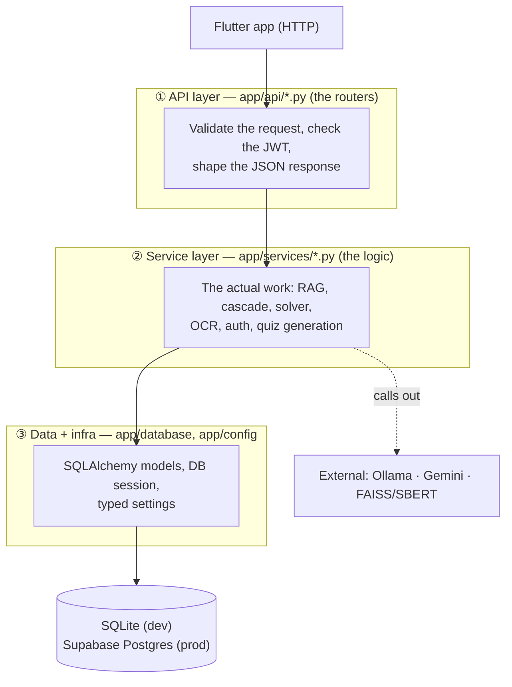
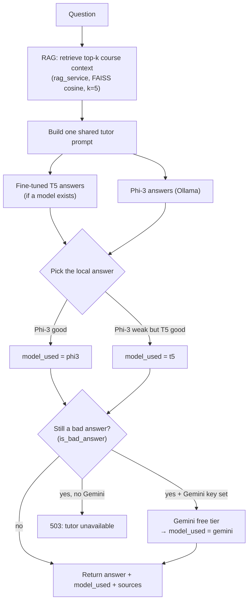

# MATHIVA Backend — Architecture

A plain-language tour of how the backend is put together: what the pieces are, how
a request flows through them, and *why* it's shaped this way. If you're new to the
codebase, read this top to bottom once — then use it as a map.

Companion docs: [`MIGRATIONS.md`](./MIGRATIONS.md) (config + database migrations)
and [`../ml/t5/README.md`](../ml/t5/README.md) (the fine-tuned model).

---

## 1. The big picture

The backend is a **FastAPI** app (Python) that the Flutter app talks to over HTTP.
Its job is to answer five kinds of request — *log in, solve an equation, solve a
photo, ask the tutor, take a quiz* — and to persist student accounts and quiz
history.

It's organized in **three layers**. Each layer only talks to the one below it,
which is what keeps the code understandable as it grows:



**Rule of thumb:** routers are thin (parse in, call a service, return out).
Services hold the real logic. The database and config are shared infrastructure
everything sits on. When you add a feature, that's the order you build it in.

---

## 2. Startup: what `main.py` does, in order

The order in [`app/main.py`](./app/main.py) is deliberate — each step depends on the
one before it:

1. **Load `.env`** (`load_dotenv`) — so config/secrets are in the environment
   *before* any module reads them.
2. **Create the `app`** and add **CORS** — lets the Flutter app call the API from a
   different origin. Auth is a Bearer token (not cookies), so `allow_credentials`
   is `False`, which is what makes the `"*"` origin wildcard legal.
3. **Add the ML path** — `sys.path.insert(... "../../ml")` so the backend can import
   your RAG (`retrieval/`) and symbolic-solver (`solver/`) code from the `ml/` tree.
4. **Register the five routers** — solve, ocr, ask, auth, quiz.
5. **`settings.validate_runtime()`** — the production safety guard (see §7).
6. **Create tables *only on SQLite*** — dev convenience; on Postgres, Alembic owns
   the schema instead (see §8).
7. **`@app.on_event("startup")` warms up Ollama** — sends one throwaway prompt so
   the *first real student* doesn't eat the model's cold-load delay.
8. **`GET /health`** — a trivial "am I up?" endpoint.

---

## 3. The five feature areas

Every feature endpoint is a **router** in `app/api/` that delegates to a **service**
in `app/services/`. All of them require a valid login (`Depends(get_current_user)`)
except `/auth/register`, `/auth/login`, and `/health`.

### 3.1 Auth — `api/auth.py` → `services/auth_service.py`

| Endpoint | Does |
|---|---|
| `POST /auth/register` | Create a student account (rejects duplicate email, password ≥ 8 chars) |
| `POST /auth/login` | Verify credentials, return a **JWT access token** |
| `GET /auth/me` | Return the token owner's profile (name/section for the home screen) |

- Passwords are **hashed with bcrypt** — never stored in plain text.
- Login returns a **JWT** (signed with `JWT_SECRET`, HS256). The app sends it back as
  `Authorization: Bearer <token>` on every later request.
- `get_current_user` is the **gatekeeper dependency**: it decodes the token, loads
  the `User` from the DB, and rejects anything invalid/expired. Any endpoint that
  lists it as a dependency is automatically protected.

### 3.2 Solve a typed equation — `api/solve.py` → `services/solver_service.py`

`POST /api/solve?equation=...` → `solve_problem()` runs the equation through
**SymPy** (`ml/solver/math_solver.py`), then `tutor_service.explain_solution()` adds
a step-by-step explanation. This path is pure math — **no LLM, no network** — so it's
fast and exact.

### 3.3 Solve a photo — `api/ocr.py` → `services/solver_service.solve_image()`

`POST /api/solve-image` (image upload) reads the picture into an equation, then
solves it exactly like §3.2. The read is **hybrid, local-first**:

1. **pix2tex** (local, free, offline) tries first.
2. Whether the read was "good enough" is decided by *the solver itself* — if SymPy
   can turn it into a real answer, we're done and **no API is called**.
3. Only if the local read fails do we fall back to **Gemini** (reads handwriting /
   photos), and we accept Gemini's result *only if it actually solves*.

This "cheap engine first, cloud only on failure" shape appears twice in the backend
(here and in the `/ask` cascade). It keeps the free-tier quota for the cases that
truly need it.

### 3.4 Ask the tutor — `api/ask.py` → `services/answer_service.py`

The most involved path, and the core thesis contribution. `POST /api/ask?question=...`
runs the **answer cascade** (detailed in §5). `POST /api/ask/stream` runs a simpler
Phi-3-only path that streams the answer token-by-token so the chat feels instant.

### 3.5 Quizzes — `api/quiz.py` → `question_generator` + `quiz_templates`

There are **two** flows here, and the difference matters:

- **Generated flow (current, secure):** `GET /api/quiz/next` returns a
  server-generated question **without** the correct answer; `POST /api/quiz/answer`
  grades it. The **server owns correctness** — the client can't cheat.
- **Legacy flow (`POST /api/quiz/submit`):** trusts the client's `is_correct` flag,
  because the answer key currently lives only in the Flutter app's local data. It's
  a documented, accepted thesis-scope limitation, kept only until the frontend moves
  fully to the generated flow, then it should be removed.

Attempts are stored so a **progress** view can aggregate them (points at
`POINTS_PER_CORRECT = 10` each, streaks by day, etc.).

---

## 4. External dependencies (what the backend calls out to)

| Dependency | Used by | Notes |
|---|---|---|
| **Ollama** (`phi` model, `localhost:11434`) | `ai_service` → `/ask` | Local LLM tutor. Capped at `num_predict=300`, kept warm 30 min, 90 s timeout |
| **Gemini** (free tier, HTTP) | `gemini_service`, `ocr_service` | Escalation for `/ask` **and** OCR for photos. Skipped cleanly if no API key |
| **FAISS + SBERT** (`all-MiniLM-L6-v2`) | `rag_service` | The RAG index. Loaded **once at import**, reused every request |
| **SymPy** (`ml/solver`) | `solver_service` | Exact symbolic equation solving |

A key robustness theme: **every external call is wrapped in a typed error**
(`AIServiceError`, `GeminiServiceError`, `OCRServiceError`) and every optional
dependency degrades gracefully — no API key just disables that tier instead of
crashing the app.

---

## 5. Deep dive: the `/ask` answer cascade

This is `answer_service.answer_question()`. The design (agreed with the team) is a
**combination with bounded escalation**, not a simple "try one then the next":



Things worth understanding:

- **RAG always runs first.** `retrieve_context` embeds the question with SBERT and
  searches a FAISS index of the course material, returning the top-k chunks (cosine
  similarity). Those chunks become the "Course Material" in the prompt, and their
  indices come back as `sources` so the UI can cite them.
- **T5 and Phi-3 both attempt the answer.** Phi-3 is currently *preferred* because
  the Phase-3 eval showed the fine-tuned T5 is weaker at today's tiny dataset size;
  T5 stays in as a backup. `model_used` records who actually answered, so the
  comparison stays visible. (Flip the preference back to T5 once it out-competes
  Phi-3 on a bigger training set — see the T5 improvement backlog.)
- **`is_bad_answer` is the gate — and it's intentionally dumb.** It flags *empty* or
  *degenerate* output (a repetition loop where almost no distinct words appear,
  e.g. `"x 0 x 0 x 0 …"` → unique-word ratio < 0.35). It is **not** a tuned
  confidence score. It deliberately does **not** flag short answers, because a
  correct math reply can be two words (`x = 4`).
- **Gemini is bounded escalation.** It's called *only* when the local answer is still
  bad, so the free-tier quota isn't spent on every question.

> **Known mismatch to reconcile later:** live retrieval uses `k=5`, but the T5 model
> was trained on **top-3** context (its 512-token budget). Feeding the T5 path top-3
> would match its training distribution. (Noted in the T5 README.)

---

## 6. The data layer — `app/database/`

- **`models.py`** defines three tables as SQLAlchemy classes: `User`,
  `QuizQuestion`, `QuizAttempt`. Timestamps use a `_utcnow()` helper (a
  future-proof replacement for the deprecated `datetime.utcnow()`).
- **`db.py`** builds the SQLAlchemy `engine` from `settings.database_url` and exposes
  **`get_db()`** — a FastAPI dependency that hands each request a fresh DB session and
  guarantees it's closed afterward. Routers get their `db` by declaring
  `db: Session = Depends(get_db)`.
- The `check_same_thread=False` connect-arg is a **SQLite-only** quirk (FastAPI may
  serve a request on a different thread than the one that opened the connection);
  Postgres doesn't need it.

Because the engine is built from `settings.database_url`, **switching from SQLite to
Postgres is just changing `DATABASE_URL`** — no model code changes.

---

## 7. Configuration & the production guard — `app/config.py`

All environment-driven values live in **one typed `settings` singleton**
(pydantic-settings) instead of scattered `os.getenv` calls. Every module imports
`settings`. Defaults keep the app runnable with **zero setup** locally.

The clever bit is **`settings.validate_runtime()`**, called once at startup:

- In **development** → it does nothing (zero friction).
- In **production** (`ENVIRONMENT=production`) → it **refuses to boot** if the JWT
  secret is still the insecure dev default, is shorter than 32 bytes, or if
  `DATABASE_URL` still points at SQLite.

So a misconfigured deploy fails **loudly at startup** instead of silently running
insecure. Think of it as a seatbelt that only tightens when the car is actually
moving.

---

## 8. Migrations & the dev/prod database split — Alembic

`create_all()` (SQLAlchemy) can only *create missing* tables — it can never *alter*
an existing one. The day you add a column to a live database with real student data,
`create_all` won't help. **Alembic** solves that: it records versioned migration
steps you can apply in order without losing data.

So the schema strategy is split by environment:

| | Local (SQLite) | Production (Supabase Postgres) |
|---|---|---|
| Schema created by | `create_all()` at startup | `alembic upgrade head` |
| Why | zero-setup convenience | safe, versioned, data-preserving |

The migration environment (`alembic/env.py`) reads the DB URL from the same
`settings`, so migrations always hit the same database the app does. Full runbook in
[`MIGRATIONS.md`](./MIGRATIONS.md). *(MATHIVA's production database is now a live
Supabase Postgres instance, migrated to revision `a05f356fd3cc`.)*

---

## 9. Request lifecycle — one full example

A student asks *"How do I solve 2x + 3 = 13?"*:

1. Flutter sends `POST /api/ask?question=...` with `Authorization: Bearer <jwt>`.
2. **CORS** allows the cross-origin call; FastAPI routes it to `ask()` in `api/ask.py`.
3. **`get_current_user`** decodes the JWT, loads the `User` — or returns 401.
4. `answer_question()` runs the **cascade**: RAG retrieves context → T5 + Phi-3
   answer → `is_bad_answer` gate → maybe Gemini.
5. The winning answer is returned as JSON with `answer`, `model_used`, and `sources`.
6. On failure (every tier down/junk) the service raises `AIServiceError`, which the
   router turns into a clean **503** — never a raw stack trace.

---

## 10. Testing & running

- **Tests** live in `backend/tests/` (pytest). They cover config validation, the
  answer cascade, the quiz API, auth, and more. External services are stubbed so the
  suite is deterministic and doesn't need Ollama running.
  ```bash
  python -m pytest -q          # from backend/
  ```
- **Run locally** (from `backend/`, with the venv active):
  ```bash
  uvicorn app.main:app --reload
  ```
  Then open `http://localhost:8000/docs` for the interactive Swagger UI — the
  fastest way to poke every endpoint by hand.

---

## 11. File map

```
backend/
├─ app/
│  ├─ main.py            App entry: startup order, CORS, routers, guard (§2)
│  ├─ config.py          Typed settings singleton + validate_runtime (§7)
│  ├─ api/               ① Routers (thin: validate → call service → respond)
│  │  ├─ auth.py         register / login / me
│  │  ├─ solve.py        /api/solve   (typed equation)
│  │  ├─ ocr.py          /api/solve-image (photo)
│  │  ├─ ask.py          /api/ask + /api/ask/stream
│  │  └─ quiz.py         generated quiz flow + legacy submit + progress
│  ├─ services/          ② Logic
│  │  ├─ auth_service.py     bcrypt + JWT + get_current_user gate
│  │  ├─ solver_service.py   SymPy solve; hybrid OCR (pix2tex→Gemini)
│  │  ├─ rag_service.py      SBERT + FAISS retrieval (loaded once)
│  │  ├─ answer_service.py   the /ask cascade + is_bad_answer gate (§5)
│  │  ├─ ai_service.py       Ollama (phi) client: generate + stream
│  │  ├─ t5_service.py       fine-tuned T5 generator (lazy, optional)
│  │  ├─ gemini_service.py   Gemini free-tier answer escalation
│  │  ├─ tutor_service.py    step-by-step explanations
│  │  ├─ question_generator.py / quiz_templates.py  quiz generation
│  │  └─ ocr_service.py      pix2tex + Gemini image→LaTeX
│  └─ database/          ③ Data
│     ├─ db.py           engine + get_db session dependency
│     └─ models.py       User, QuizQuestion, QuizAttempt
├─ alembic/              Migrations (schema source of truth on Postgres)
├─ tests/                pytest suite
├─ MIGRATIONS.md         Config + DB migration runbook
└─ ARCHITECTURE.md       You are here
```

---

## 12. Design decisions & accepted limitations

- **Cheap-first, cloud-on-failure** appears in both `/ask` (local models → Gemini)
  and OCR (pix2tex → Gemini) — protects the free-tier quota.
- **Dumb, objective gates over tuned scores.** `is_bad_answer` and the OCR
  "does it solve?" check are structural, not calibrated confidence thresholds — a
  deliberate simplicity choice.
- **Graceful degradation everywhere.** No Gemini key, no trained T5, no Ollama —
  each just disables its tier; the app still runs.
- **Legacy `/quiz/submit` trusts the client** because the answer key lives only in
  the Flutter app for now — a known thesis-scope tradeoff, to be removed once the
  generated flow fully replaces it.
- **The fine-tuned T5 is currently weaker than Phi-3** at the dataset's tiny size;
  the cascade prefers Phi-3 today and the preference flips once the training set
  grows. See `ml/t5/README.md` and the improvement backlog.
```
